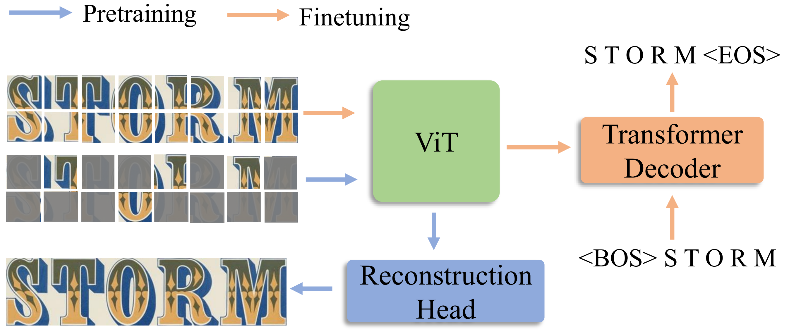

/# Union14M Dataset

<div align=center>
  
</div>
<div align=center>
  <p >Union14M is a large scene text recognition (STR) dataset collected from 17 publicly available datasets, which contains 4M of labeled data (Union14M-L) and 10M of unlabeled data (Union14M-U), intended to provide a more profound analysis for the STR community</p>
</div>
<p align="center">
   <strong><a href="#sota">arXiv </a></strong> •
   <strong><a href="#1-introduction">Introduction </a></strong> •
   <strong><a href="#34-download">Download </a></strong> •
   <strong><a href="#5-maerec">MAERec</a></strong> •
   <strong><a href="#6-qas">QAs</a></strong>
   
</p>

## 1. Introduction

- Scene Text Recognition (STR) is a fundamental task in computer vision, which aims to recognize the text in natural images. STR has been developed rapidly in recent years, and recent state-of-the-arts have shown a trend of accuracy saturation on six commonly used benchmarks (IC13, IC15, SVT, IIIT5K, SVTP, CUTE80). This is a promissing result, but it also raises a question: **Are we done with STR?** Or it's just the lack of challenges in current benchmarks that cover the drawbacks of existing methods in read-world scenarios.
<div align=center>
  
  
</div>

- To explore the challenges that STR models still face, we consolidate a large-scale STR dataset for analysis and identified seven open challenges. Furthermore, we propose a challenge-driven benchmark to facilitate the future development of STR. Additionally, we reveal that the utilization of massive unlabeled data through self-supervised pre-training can remarkably enhance the performance of the STR model in real-world scenarios, suggesting a practical solution for STR from a data perspective. We hope this work can spark future research beyond the realm of existing data paradigms.

## 2. Contents
- [1. Introduction](#1-introduction)
- [2. Contents](#2-contents)
- [3. Union14M Dataset](#3-union14m-dataset)
  - [3.1. Union14M-L](#31-union14m-l)
  - [3.2. Union14M-U](#32-union14m-u)
  - [3.3. Union14M-Benchmark](#33-union14m-benchmark)
  - [3.4. Download](#34-download)
- [4. STR Models trained on Union14M-L](#4-str-models-trained-on-union14m-l)
  - [4.1. Checkpoints](#41-checkpoints)
- [5. MAERec](#5-maerec)
  - [5.1. Pre-training](#51-pre-training)
  - [5.2. Fine-tuning](#52-fine-tuning)
  - [5.3 Inferencing](#53-inferencing)
- [6. QAs](#6-qas)
- [7. License](#7-license)

## 3. Union14M Dataset
### 3.1. Union14M-L
- Union14M-L contains 4M images collected from 14 public available datasets. See [Source Datasets](docs/source_dataset.md) for the details of the 14 datasets. We adopt serval strategies to refine the naive concatation of the 14 datasaets, including:
  - **Cropping**: We use minimal axis-aligned bounding box to crop the images.
  - **De-duplicate**: Some datasets contains duplicate images, we remove them.
- We also categorize the images in Union14M-L into five difficulty levels using an error voting method. 
<div align=center>
  
</div>

### 3.2. Union14M-U
- The optimal solution to improve the performance of STR in real-world scenarios is to utilize more data for training. However, labeling text images is both costly and time-intensive, given that it involves annotating sequences and needs specialized language expertise. Therefore, it would be desirable to investigate the potential of utilizing unlabeled data via self-supervised learning for STR. To this end we collect
10M unlabeled images from 3 large datasets, using an IoU Voting method
<div align=center>
  
</div>

### 3.3. Union14M-Benchmark
- We raise seven open challenges for STR in real-world scenarios, and propose a challenge-driven benchmark to facilitate the future development.
<div align=center>
  
</div>

### 3.4. Download

  | Datasets                        | Google Drive            | Baidu Netdisk     |
  | ------------------------------- | ----------------------- | ----------------- |
  | Union14M-L / Union14M-Benchmark | [Google Drive (8 GB)]() | [Baidu Netdisk]() |
  | Union14M-U                      | [Google Drive (8 GB)]() | [Baidu Netdisk]() |


- The Structure of Union14M will be organized as follows:

  <details close>
  <summary><strong>Structure of Union14M-L & Union14M-Benchmark</strong></summary>

    ```text
    |--Union14M-L
      |--full_images
        |--art_curve # Images collected from the 14 datasets
        |--art_scene
        |--COCOTextV2
        |--...
      |--train_annos
        |--mmocr-0.x # annotation in mmocr0.x format
          |--train_challenging.jsonl # challenging subset
          |--train_easy.jsonl # easy subset
          |--train_hard.jsonl # hard subset
          |--train_medium.jsonl # medium subset
          |--train_normal.jsonl # normal subset
          |--val_annos.jsonl # validation subset
        |--mmocr1.0.x # annotation in mmocr1.0 format
          |--...
      |--Union14M-Benchmarks
        |--artistic
          |--imgs
          |--annotation.json # annotation in mmocr1.0 format
          |--annotation.jsonl # annotation in mmocr0.x format
        |--...
    ```

  </details>

  <details close>
  <summary><strong>Structure of Union14M-U</strong></summary>

  ```text
  |--Union14M-U
    |--book32
      |--
    |--cc
      |--cc
        |--img1.jpg
        |--...
    |--openvino
      |--test
        |--img1.jpg
        |--...
      |--train_0
        |--img1.jpg
        |--...
      |--train_3
        |--img1.jpg
        |--...
      |--...
  ```
  </details>

## 4. STR Models trained on Union14M-L
- We train serval STR models on Union14M-L using [MMOCR-1.0](https://github.com/open-mmlab/mmocr/tree/dev-1.x)

### 4.1. Checkpoints
- Evaluated on both common benchmarks and Union14M-Benchmark. Accuracy (WAICS) in gray are original implementation, and accuracay in green are trained on Union14M-L. Our models are trained to predict **upper & lower text, symbols and space.**

  |         Models         |  Checkpoint  |                    IIIT5K                    |                     IC13                     |                     IC15                     |                     SVT                      |                     SVTP                     |                    CUTE80                    |                     Avg.                     |
  | :--------------------: | :----------: | :------------------------------------------: | :------------------------------------------: | :------------------------------------------: | :------------------------------------------: | :------------------------------------------: | :------------------------------------------: | :------------------------------------------: |
  |     [ASTER](#TODO)     | [Download]() | $\color{grey}{95.4}$ \ $\color{green}{95.4}$ | $\color{grey}{95.4}$ \ $\color{green}{95.4}$ | $\color{grey}{95.4}$ \ $\color{green}{95.4}$ | $\color{grey}{95.4}$ \ $\color{green}{95.4}$ | $\color{grey}{95.4}$ \ $\color{green}{95.4}$ | $\color{grey}{95.4}$ \ $\color{green}{95.4}$ | $\color{grey}{95.4}$ \ $\color{green}{95.4}$ |
  |    [ABINet](#TODO)     | [Download]() | $\color{grey}{95.4}$ \ $\color{green}{95.4}$ | $\color{grey}{95.4}$ \ $\color{green}{95.4}$ | $\color{grey}{95.4}$ \ $\color{green}{95.4}$ | $\color{grey}{95.4}$ \ $\color{green}{95.4}$ | $\color{grey}{95.4}$ \ $\color{green}{95.4}$ | $\color{grey}{95.4}$ \ $\color{green}{95.4}$ | $\color{grey}{95.4}$ \ $\color{green}{95.4}$ |
  |     [NRTR](#TODO)      | [Download]() | $\color{grey}{95.4}$ \ $\color{green}{95.4}$ | $\color{grey}{95.4}$ \ $\color{green}{95.4}$ | $\color{grey}{95.4}$ \ $\color{green}{95.4}$ | $\color{grey}{95.4}$ \ $\color{green}{95.4}$ | $\color{grey}{95.4}$ \ $\color{green}{95.4}$ | $\color{grey}{95.4}$ \ $\color{green}{95.4}$ | $\color{grey}{95.4}$ \ $\color{green}{95.4}$ |
  |     [SATRN](#TODO)     | [Download]() | $\color{grey}{95.4}$ \ $\color{green}{95.4}$ | $\color{grey}{95.4}$ \ $\color{green}{95.4}$ | $\color{grey}{95.4}$ \ $\color{green}{95.4}$ | $\color{grey}{95.4}$ \ $\color{green}{95.4}$ | $\color{grey}{95.4}$ \ $\color{green}{95.4}$ | $\color{grey}{95.4}$ \ $\color{green}{95.4}$ | $\color{grey}{95.4}$ \ $\color{green}{95.4}$ |
  |    [MASTER](#TODO)     | [Download]() | $\color{grey}{95.4}$ \ $\color{green}{95.4}$ | $\color{grey}{95.4}$ \ $\color{green}{95.4}$ | $\color{grey}{95.4}$ \ $\color{green}{95.4}$ | $\color{grey}{95.4}$ \ $\color{green}{95.4}$ | $\color{grey}{95.4}$ \ $\color{green}{95.4}$ | $\color{grey}{95.4}$ \ $\color{green}{95.4}$ | $\color{grey}{95.4}$ \ $\color{green}{95.4}$ |
  | [RobustScanner](#TODO) | [Download]() | $\color{grey}{95.4}$ \ $\color{green}{95.4}$ | $\color{grey}{95.4}$ \ $\color{green}{95.4}$ | $\color{grey}{95.4}$ \ $\color{green}{95.4}$ | $\color{grey}{95.4}$ \ $\color{green}{95.4}$ | $\color{grey}{95.4}$ \ $\color{green}{95.4}$ | $\color{grey}{95.4}$ \ $\color{green}{95.4}$ | $\color{grey}{95.4}$ \ $\color{green}{95.4}$ |
  |      [SAR](#TODO)      | [Download]() | $\color{grey}{95.4}$ \ $\color{green}{95.4}$ | $\color{grey}{95.4}$ \ $\color{green}{95.4}$ | $\color{grey}{95.4}$ \ $\color{green}{95.4}$ | $\color{grey}{95.4}$ \ $\color{green}{95.4}$ | $\color{grey}{95.4}$ \ $\color{green}{95.4}$ | $\color{grey}{95.4}$ \ $\color{green}{95.4}$ | $\color{grey}{95.4}$ \ $\color{green}{95.4}$ |


## 5. MAERec
- MAERec is a scene text recognition model composed of a ViT backbone and a Transformer decoder in auto-regressive style. It shows an outstanding performance in scene text recognition, especially when pre-trained on the Union14M-U through MAE.

  <div align=center>
    
  </div>

- Results of MAERec on six common benchmarks and Union14M-Benchmarks

  <div align=center>
    
  </div>

- Predictions of MAERec on some challenging examples

  <div align=center>
    
  </div>


### 5.1. Pre-training 
- Pre-trained ViT

  | Variants  | Input Size | Patch Size | Embedding | Depth | Heads | Parameters | Google Drive | Baidu Netdisk |
  | --------- | ---------- | ---------- | --------- | ----- | ----- | ---------- | ------------ | ------------- |
  | ViT-Small | 32x128     | 4x4        | 384       | 12    | 6     |            |              |               |
  | ViT-Base  | 32x128     | 4x4        | 768       | 12    | 12    |            |              |               |
- If you want to pre-train the ViT backbone on your own dataset, check [pre-training](docs/pretrain.md)

### 5.2. Fine-tuning 
- Fine-tuned MAERec

  | Variants     | Acc on Common Benchmarks | Acc on Union14M-Benchmarks | Google Drive | Baidu Netdisk |
  | ------------ | ------------------------ | -------------------------- | ------------ | ------------- |
  | MAERec-Small | 95.1                     | 78.6                       |              |               |
  | MAERec-Base  | 96.2                     | 85.2                       |              |               |

- If you want to fine-tune MAERec on your own dataset, check [fine-tuning](docs/finetune.md)

### 5.3 Inferencing
- If you want to inferencing MAERec on your raw pictures, check [inferencing](docs/inferencing.md)

## 6. QAs


## 7. License

